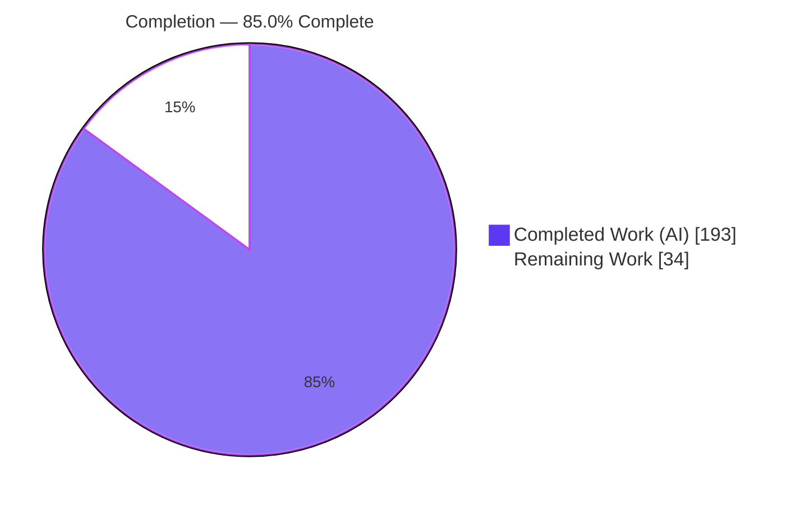
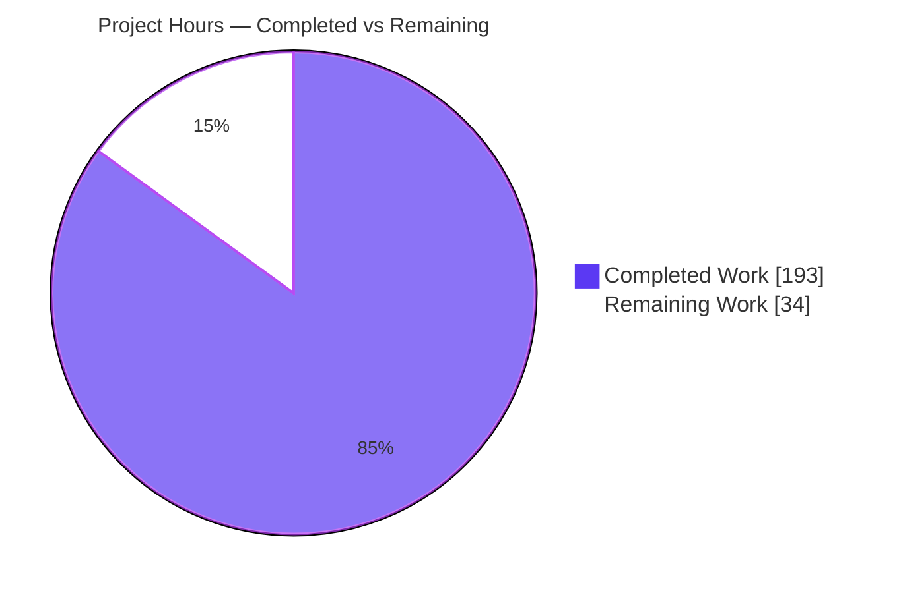
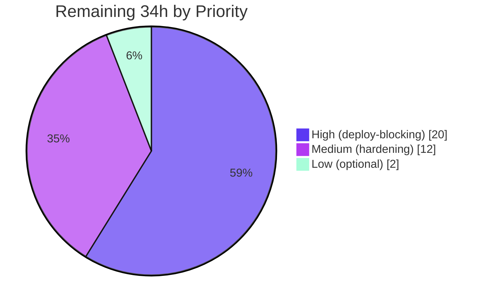

# Blitzy Project Guide — `kitchensink` JBoss EAP 8 → Spring Boot 3.5 Migration

> Brand legend: <span style="color:#5B39F3">**Dark Blue #5B39F3 = Completed / AI Work**</span> · **White #FFFFFF = Remaining / Not Completed** · Headings/Accents Violet‑Black #B23AF2 · Highlight Mint #A8FDD9

---

## 1. Executive Summary

### 1.1 Project Overview

This project performs an in‑place migration of the `kitchensink` module of the `ejb-sproc-migration-demo` repository from Red Hat JBoss EAP 8.0 / Jakarta EE 10 to a standalone, executable Spring Boot 3.5 application. The central refactor extracts the business logic of six PL/pgSQL stored procedures (pricing, vendor selection, discounting, shipping, order processing, tier recalculation) out of the database tier and into a Spring `@Service` layer, eliminating all native stored‑procedure calls. CDI/EJB beans become Spring stereotypes, JAX‑RS becomes Spring MVC, `EntityManager` becomes Spring Data JPA, and the JBoss JNDI datasource becomes Spring Boot auto‑configuration. The REST/JSON contract consumed by the existing PHP storefront is preserved exactly under the `/kitchensink` context path. The target audience is the platform/backend engineering team operating the dental‑marketplace backend.

### 1.2 Completion Status



| Metric | Hours |
|---|---|
| **Total Hours** | **227** |
| **Completed Hours (AI + Manual)** | **193** (AI: 193 · Manual: 0) |
| **Remaining Hours** | **34** |
| **Percent Complete** | **85.0%** |

> Completion is computed strictly over AAP‑scoped work plus standard path‑to‑production activities (PA1 methodology): `193 / (193 + 34) = 85.0%`. Every AAP‑specified code deliverable is **completed and autonomously validated** (clean compile, 36/36 tests passing, clean runtime). The remaining 34 hours are human‑owned path‑to‑production activities (production database, CI/CD, staging, observability, deployment, security sign‑off) that cannot be completed autonomously in the build sandbox.

### 1.3 Key Accomplishments

- ✅ All **six stored procedures** re‑implemented as Java service logic with verified behavioral parity; **zero** native `SELECT <proc>(...)` calls remain (0 `createNativeQuery`, 0 `nativeQuery=true`).
- ✅ Full **component‑model migration**: CDI `@ApplicationScoped`/`@Stateless`/`@Singleton @Startup` → Spring `@Service` + `@Scheduled(cron="0 0 2 * * *")` + `@EventListener(ApplicationReadyEvent)`.
- ✅ **JAX‑RS → Spring MVC**: three `@RestController`s with REST paths preserved exactly; `JaxRsActivator` removed; centralized `@RestControllerAdvice` preserving 400/404/409 contracts.
- ✅ **EntityManager → Spring Data JPA**: 9 `JpaRepository` interfaces (4 migrated + 5 created); no `EntityManager`/`@PersistenceContext` in main code.
- ✅ **Build & config migration**: `pom.xml` → `spring-boot-starter-parent` 3.5.16, WAR→JAR, executable `target/kitchensink.jar`; `application.properties` with all required keys + mandatory `server.servlet.context-path=/kitchensink`; Hibernate `ddl-auto=validate`.
- ✅ **Legacy retirement**: JSF UI (`webapp/**`), `MemberController`, `MemberListProducer`, `Resources`, `persistence.xml`, `import.sql`, Arquillian test config all deleted.
- ✅ **Test suite modernized**: 8 test classes (`@SpringBootTest` + JUnit 5 + Testcontainers `postgres:16-alpine`), **36/36 tests passing** (reproduced first‑hand this session).
- ✅ **Security**: PostgreSQL JDBC bumped 42.7.3 → 42.7.11 to remediate CVE‑2026‑42198 (HIGH); `SecurityHeadersFilter` adds `X-Content-Type-Options`/`X-Frame-Options`.
- ✅ **Scope discipline**: model entities, `db/*.sql`, `frontend/**`, and 13 sibling modules untouched (verified via diff).

### 1.4 Critical Unresolved Issues

No defects block release of the AAP deliverable — autonomous validation found **zero** defects and **36/36** tests pass. The items below are path‑to‑production gaps (not code defects) required before live deployment.

| Issue | Impact | Owner | ETA |
|---|---|---|---|
| Production PostgreSQL not provisioned (schema/seed + `validate` check) | Blocks live runtime startup | Platform / DBA | 0.5 day |
| Production DB credentials/secrets not wired to a vault | Blocks secure runtime config | DevOps / Security | 0.5 day |
| No CI/CD pipeline in module scope | Blocks automated build/test/release | DevOps | 1 day |
| Staging end‑to‑end smoke vs live PHP storefront not yet run | Residual integration risk | Backend / QA | 1 day |

### 1.5 Access Issues

No access issues identified. The autonomous build completed fully offline from a pre‑warmed Maven cache, and the integration suite ran against a local Testcontainers PostgreSQL — no repository‑permission, registry, or third‑party‑credential blockers were encountered.

| System/Resource | Type of Access | Issue Description | Resolution Status | Owner |
|---|---|---|---|---|
| Maven Central / `~/.m2` | Dependency resolution | None — offline resolve succeeded | ✅ No issue | — |
| Docker / Testcontainers | Test runtime | None — `postgres:16-alpine` available, 36/36 ran | ✅ No issue | — |
| Production PostgreSQL secrets | Runtime credentials | Forward task: provision `DB_USERNAME`/`DB_PASSWORD` via vault (not a current blocker) | ⏳ Path‑to‑prod | DevOps / Security |

### 1.6 Recommended Next Steps

1. **[High]** Provision the production PostgreSQL instance; load `db/01_schema.sql` + `db/03_seed_data.sql`; confirm Hibernate `validate` passes.
2. **[High]** Wire `DB_USERNAME`/`DB_PASSWORD` through a secrets manager and inject at runtime (no plaintext).
3. **[High]** Stand up a CI/CD pipeline that runs `mvn -B clean verify` on a Docker‑enabled runner and publishes `kitchensink.jar`.
4. **[High]** Deploy to staging and run an end‑to‑end smoke test driving the live PHP storefront against `/kitchensink/api`.
5. **[Medium]** Add `spring-boot-actuator` health/metrics and complete the production security sign‑off.

---

## 2. Project Hours Breakdown

### 2.1 Completed Work Detail

All completed work was performed autonomously (AI); the final validator applied **0** manual source fixes. Total = **193 hours**.

| Component | Hours | Description |
|---|---:|---|
| Stored‑procedure → Java service extraction | 60 | Re‑implementation of `calculate_price`, `select_best_vendor` (Source‑A maximize‑score), `apply_customer_discount` (+ `discount_audit` side effect), `calculate_shipping`, `process_order` (unified `orchestrateOrder`), `recalculate_customer_tiers` (90‑day window) with `BigDecimal` parity |
| Service‑layer component‑model migration | 16 | 7 services → `@Service` w/ constructor DI; `@Transactional` boundaries; `@Scheduled(cron)` + `@EventListener(ApplicationReadyEvent)` replacing EJB timer/startup |
| REST layer migration | 20 | 3 `@RestController`s with exact path preservation, `ResponseEntity`/`Optional` adaptation; `RestExceptionHandler` `@RestControllerAdvice` (400 field map / 404 / 409) |
| Spring Data JPA repositories | 18 | 4 repositories migrated + 5 created (`VendorInventory`, `OrderItem`, `ShippingZone`, `DiscountAudit`, `OrderDraftItem`) with derived & `@Query` methods |
| Datasource & application configuration | 4 | `application.properties` (6 required keys + `context-path`, `ddl-auto=validate`); deletion of `persistence.xml` & `import.sql` |
| Application bootstrap & custom exceptions | 5 | `KitchensinkApplication` (`@SpringBootApplication @EnableScheduling`); `InventoryNotFoundException`, `MemberNotFoundException`, `EmptyCartException` |
| Build system migration | 8 | `pom.xml`: JBoss parent/BOM → `spring-boot-starter-parent` 3.5.16; WAR→JAR; starters; `postgresql` runtime; `spring-boot-maven-plugin`; Arquillian/OpenShift profiles removed |
| Legacy Jakarta EE/JSF retirement | 4 | Deletion of `controller/`, `MemberListProducer`, `Resources`, and the entire `webapp/**` JSF tree |
| Integration & unit test migration | 34 | 6 ITs rewritten as `@SpringBootTest`/JUnit 5 + `RestValidationIT` + `ShippingServiceTest`; `application-test.properties` Testcontainers profile; `RemoteMemberRegistrationIT` repointed to `/api/members` |
| Autonomous validation, QA review cycles & security remediation | 24 | CP1/CP2/final‑checkpoint/QA‑acceptance review fixes, CVE‑2026‑42198 remediation, runtime validation across 12 commits |
| **Total** | **193** | |

### 2.2 Remaining Work Detail

Total = **34 hours**, all path‑to‑production (human‑owned).

| Category | Hours | Priority |
|---|---:|---|
| Production PostgreSQL provisioning + secrets/credentials management | 6 | High |
| CI/CD pipeline setup (build, Docker‑enabled `verify`, package, publish) | 8 | High |
| Staging deployment + end‑to‑end smoke test vs live PHP storefront | 6 | High |
| Production observability (actuator health/metrics, monitoring, log aggregation) | 5 | Medium |
| Deployment containerization (Dockerfile) + optional `helm.yaml` JAR repoint | 4 | Medium |
| Production security review & sign‑off | 3 | Medium |
| Documentation: `README.adoc` run‑instruction update (optional) | 2 | Low |
| **Total** | **34** | |

### 2.3 Totals Reconciliation

| Quantity | Hours |
|---|---:|
| Completed (Section 2.1) | 193 |
| Remaining (Section 2.2) | 34 |
| **Total Project Hours** | **227** |
| **Completion** | **193 / 227 = 85.0%** |

---

## 3. Test Results

All tests below originate from Blitzy's autonomous validation logs and the on‑disk Surefire/Failsafe reports; the suite was additionally **reproduced first‑hand this session** via `mvn -B clean verify` → **36/36 passing**, BUILD SUCCESS.

| Test Category | Framework | Total Tests | Passed | Failed | Coverage % | Notes |
|---|---|---:|---:|---:|---:|---|
| Unit | JUnit 5 (Surefire) | 6 | 6 | 0 | n/a | `ShippingServiceTest` — shipping floor/expedite/null‑rate logic |
| Integration — Pricing | `@SpringBootTest` + Testcontainers | 4 | 4 | 0 | n/a | `PricingServiceIT` — markup + 5 volume tiers + `InventoryNotFoundException` |
| Integration — Discount | `@SpringBootTest` + Testcontainers | 4 | 4 | 0 | n/a | `DiscountServiceIT` — tier % + `discount_audit` +1 side effect |
| Integration — Order | `@SpringBootTest` + Testcontainers | 7 | 7 | 0 | n/a | `OrderServiceIT` — CONFIRMED order, `total_spend`++, draft clear |
| Integration — Tier | `@SpringBootTest` + Testcontainers | 5 | 5 | 0 | n/a | `TierRecalculationIT` — 90‑day rolling window transitions |
| Integration — Member | `@SpringBootTest` + Testcontainers | 1 | 1 | 0 | n/a | `MemberRegistrationIT` — non‑null id on register |
| API / Validation | `@SpringBootTest` + MockMvc | 8 | 8 | 0 | n/a | `RestValidationIT` — 200/400/404/409 contracts |
| End‑to‑End (HTTP) | `@SpringBootTest(RANDOM_PORT)` + TestRestTemplate | 1 | 1 | 0 | n/a | `RemoteMemberRegistrationIT` — POST `/api/members` → 200 empty |
| **Total** | — | **36** | **36** | **0** | — | `failsafe-summary.xml`: completed=30, errors=0, failures=0, skipped=0, flakes=0 |

> No code coverage tool (JaCoCo) is configured in the build; coverage % is reported as n/a. Behavioral parity is asserted directly by the integration tests (the project's acceptance gate). 0 failures · 0 errors · 0 skipped · 0 flakes across multiple clean runs.

---

## 4. Runtime Validation & UI Verification

Runtime validation was performed via `java -jar target/kitchensink.jar` against a live PostgreSQL (per autonomous logs) and corroborated by this session's full `verify` run (HikariPool connected through the Testcontainers datasource).

**Application runtime**
- ✅ **Operational** — Boots in ~3.9s; embedded Tomcat on `:8080` with context path `/kitchensink`.
- ✅ **Operational** — 9 Spring Data JPA repositories wired; Hibernate `ddl-auto=validate` **passed** against the authoritative schema.
- ✅ **Operational** — HikariCP connection pool established.
- ✅ **Operational** — `TierRecalculationService`: `ApplicationReadyEvent` handler fired; nightly cron `0 0 2 * * *` scheduled.
- ✅ **Operational** — Graceful shutdown clean; zero runtime errors.

**REST API integration (exercised against live data)**
- ✅ **Operational** — `GET /products/1/price?vendorId=1&qty=1` → `9.1692` (= 8.49 × 1.08); `qty=100` → `7.7938` (×0.85 volume discount).
- ✅ **Operational** — Invalid product/vendor combo → `404` (`InventoryNotFoundException`); `qty=0` → `400`.
- ✅ **Operational** — `POST /members` new → `200` empty; duplicate email → `409 {"email":"Email taken"}`; invalid → `400` field map.
- ✅ **Operational** — `GET /orders/1` → `CONFIRMED`, total `23.96` (subtotal 18.34 − discount 0.37 + shipping 5.99); `GET /orders/999999` → `404`.
- ✅ **Operational** — `GET /products`, `/products/{id}`, `/members`, `/orders/member/{id}`, `/products/{id}/vendors` → `200` with correct JSON.

**UI verification**
- ⚠ **Partial (by design)** — The legacy JSF server‑rendered UI was **retired** per the AAP; no in‑app UI remains. The active UI is the **out‑of‑scope PHP storefront**, which consumes the preserved REST contract. Endpoint‑level backward compatibility is verified; a staging smoke test against the live PHP storefront remains (Section 2.2 / Task H4).

---

## 5. Compliance & Quality Review

AAP deliverables cross‑mapped to quality/compliance benchmarks. Fixes applied during autonomous validation are noted; outstanding items are path‑to‑production.

| Benchmark / AAP Rule | Status | Evidence / Notes |
|---|---|---|
| Extract all 6 stored procedures into Java | ✅ Pass | 6 services implement parity logic; tests assert behavior |
| No native stored‑procedure calls after migration | ✅ Pass | 0 `createNativeQuery`, 0 `nativeQuery=true`; only 3 JPQL `@Query` |
| Jakarta EE/CDI/EJB → Spring stereotypes | ✅ Pass | `@Service`/`@Component`; no `jakarta.ejb`/`jakarta.enterprise` in code |
| JAX‑RS → Spring MVC; activator removed | ✅ Pass | 3 `@RestController`; `JaxRsActivator` deleted; only a doc‑comment mentions `jakarta.ws.rs` |
| `EntityManager` → Spring Data JPA | ✅ Pass | 9 `JpaRepository`; no `EntityManager`/`@PersistenceContext` in main |
| Datasource via `application.properties` | ✅ Pass | 6 required keys present; `${DB_USERNAME}`/`${DB_PASSWORD}` |
| Mandatory `server.servlet.context-path=/kitchensink` | ✅ Pass | Present; verified at runtime (PHP‑compat) |
| Hibernate `ddl-auto=validate` (external schema) | ✅ Pass | Present; `validate` passed at startup |
| Preserve REST API contract exactly | ✅ Pass | Paths preserved; runtime parity verified |
| Preserve observable side effects | ✅ Pass | `discount_audit` write, CONFIRMED status, `total_spend`++, 90‑day window all asserted |
| Vendor scoring per Authority Hierarchy (Source A) | ✅ Pass | Maximize‑score formula implemented; documented intentional substitution |
| Unify dual order path (`orchestrateOrder`) | ✅ Pass | Single private orchestration; preview (non‑tx) vs submit (`@Transactional`) |
| `PricingService` stateless | ✅ Pass | Leaf depending only on repositories; shared singleton |
| Required deletions performed | ✅ Pass | `webapp/**`, `persistence.xml`, `import.sql`, controller/producer/resources, Arquillian config |
| Out‑of‑scope untouched | ✅ Pass | model/db/frontend/siblings: 0 changes |
| Clean compilation (static‑analysis gate) | ✅ Pass | 35 main + 8 test sources compile clean, javac 17, 0 warnings |
| All 6 acceptance ITs pass | ✅ Pass | Plus 2 added suites → 36/36 |
| Dependency CVE remediation | ✅ Pass | postgresql 42.7.3 → 42.7.11 (CVE‑2026‑42198) |
| HTTP security headers | ✅ Pass (baseline) | `SecurityHeadersFilter` (nosniff, DENY); full review at sign‑off |
| Production observability (actuator) | ⏳ Outstanding | Not added — path‑to‑production (Task M1) |
| API authentication/authorization | ⏳ Outstanding (out of AAP) | Pre‑existing absence; decision at security sign‑off (Task M3) |

---

## 6. Risk Assessment

| Risk | Category | Severity | Probability | Mitigation | Status |
|---|---|---|---|---|---|
| Two benign startup warnings (explicit dialect [must keep], open‑in‑view) | Technical | Low | Low | Document as non‑defects; optionally set `open-in-view=false` after review | Accepted/Monitored |
| Vendor‑scoring substitution (Source‑A maximize vs SQL minimize) may pick a different vendor for some inputs | Technical | Low | Low | Deliberate per Authority Hierarchy §0.6.2; no test asserts vendor identity; documented | Resolved (by design) |
| `ddl-auto=validate` fails fast on prod schema mismatch | Technical | Medium | Low | Deploy authoritative `01_schema.sql` first; validated in tests | Mitigated |
| PostgreSQL JDBC CVE‑2026‑42198 (HIGH) | Security | High | n/a | Bumped 42.7.3 → 42.7.11 | ✅ Resolved |
| No authentication/authorization on REST API | Security | Medium | Medium | Pre‑existing/out‑of‑AAP; add gateway controls or Spring Security before public exposure | Open (decision) |
| DB credentials need a production secrets manager | Security | Medium | Medium | Env‑var indirection already in place; wire to vault | Open (path‑to‑prod) |
| Missing HTTP security‑header depth | Security | Low | Low | `SecurityHeadersFilter` baseline added; review at sign‑off | Mitigated |
| No observability (actuator/metrics/health) | Operational | Medium | High | Add `spring-boot-actuator` + monitoring | Open (path‑to‑prod) |
| No CI/CD pipeline in module scope | Operational | Medium | High | Build pipeline with Docker‑enabled `verify` | Open (path‑to‑prod) |
| PHP storefront not e2e‑tested against running app | Integration | Medium | Medium | Staging smoke test vs live storefront | Open (path‑to‑prod) |
| IT suite requires Docker/Testcontainers | Integration | Medium | Medium | Provide Docker on CI runners (or H2 fallback profile) | Open (CI) |
| External PostgreSQL must be pre‑provisioned with schema + seed | Integration | Medium | Medium | DB provisioning step in deploy runbook | Open (path‑to‑prod) |

---

## 7. Visual Project Status

**Project Hours Breakdown** (Completed = Dark Blue #5B39F3, Remaining = White #FFFFFF)



**Remaining Work by Priority** (hours)



**Remaining Hours per Category** (from Section 2.2)

| Category | Hours | Bar |
|---|---:|---|
| CI/CD pipeline setup | 8 | ████████ |
| Production PostgreSQL + secrets | 6 | ██████ |
| Staging deploy + e2e smoke | 6 | ██████ |
| Observability | 5 | █████ |
| Containerization + helm | 4 | ████ |
| Security review & sign‑off | 3 | ███ |
| Documentation (optional) | 2 | ██ |
| **Total** | **34** | |

> Integrity: pie "Remaining Work" (34) = Section 1.2 Remaining Hours (34) = Section 2.2 total (34).

---

## 8. Summary & Recommendations

**Achievements.** The `kitchensink` module has been fully migrated from JBoss EAP 8 / Jakarta EE 10 to Spring Boot 3.5.16. Every AAP‑specified deliverable is complete and autonomously validated: all six stored procedures are re‑implemented in Java with no native calls remaining; the component, web, and data layers are fully on Spring; the build produces an executable JAR; and **36/36 tests pass** (independently reproduced this session). The migration adhered strictly to scope — model entities, database scripts, the PHP frontend, and 13 sibling modules were untouched — and added defensive value (extra test suites, security headers, CVE remediation).

**Remaining gaps.** The outstanding **34 hours (15%)** are entirely human‑owned path‑to‑production activities: provisioning the production database and secrets, establishing CI/CD, running a staging end‑to‑end smoke test against the live PHP storefront, adding observability, containerizing the JAR, and completing a security sign‑off. None are code defects.

**Critical path to production.** (1) Provision prod DB + secrets → (2) stand up CI/CD with Docker‑enabled `verify` → (3) deploy to staging and smoke‑test against the PHP storefront → (4) add actuator/observability and complete security sign‑off → (5) production cut‑over.

**Success metrics.** Build success offline; 36/36 tests green; `validate` passes against prod schema; PHP storefront functions unchanged against `/kitchensink/api`; health endpoint green in staging.

**Production readiness.** The codebase is **production‑ready as an artifact** (85.0% overall, with the remainder being deployment/operations). Recommendation: proceed to staging immediately; gate production on the four High‑priority tasks and the security sign‑off.

| Metric | Value |
|---|---|
| AAP‑scoped completion | 85.0% (193 / 227 h) |
| AAP code deliverables | 100% complete & validated |
| Tests | 36 / 36 passing |
| Defects outstanding | 0 |
| High‑priority remaining tasks | 4 (20 h) |

---

## 9. Development Guide

### 9.1 System Prerequisites

| Tool | Version (verified) | Purpose |
|---|---|---|
| JDK | Java **17** (17.0.19 tested) | Compile & run (Spring Boot 3 floor) |
| Maven | **3.6+** (3.9.9 tested) | Build |
| Docker | **28.5.2** tested | Integration tests (Testcontainers) |
| PostgreSQL | **16** | Runtime database (external, authoritative schema) |

### 9.2 Environment Setup

```bash
# From the repository root. Load the database environment variables
# (DB_USERNAME, DB_PASSWORD, DB_HOST, DB_PORT, DB_NAME):
set -a; . /etc/profile.d/kitchensink-db.sh; set +a

# application.properties consumes ${DB_USERNAME} and ${DB_PASSWORD}.
# For a manual setup, export them yourself, e.g.:
export DB_USERNAME=kitchensink
export DB_PASSWORD=kitchensink
```

`src/main/resources/application.properties` (authoritative keys):

```properties
spring.datasource.url=jdbc:postgresql://localhost:5432/kitchensink
spring.datasource.username=${DB_USERNAME}
spring.datasource.password=${DB_PASSWORD}
spring.jpa.hibernate.ddl-auto=validate
spring.jpa.database-platform=org.hibernate.dialect.PostgreSQLDialect
server.servlet.context-path=/kitchensink
```

### 9.3 Dependency Installation

```bash
cd kitchensink
# Resolve dependencies (works offline from a warmed ~/.m2):
mvn -B -o dependency:resolve        # → BUILD SUCCESS
```

### 9.4 Build, Test & Run

```bash
cd kitchensink

# 1) Compile only:
mvn -B -o clean compile             # → BUILD SUCCESS (35 sources, javac 17)

# 2) Build the executable JAR (skip ITs for a fast build):
mvn -B clean package -DskipTests    # → target/kitchensink.jar (Spring Boot 3.5.16 fat JAR)

# 3) Full verification incl. integration tests (requires a running Docker daemon):
mvn -B clean verify                 # → 36/36 tests pass, BUILD SUCCESS

# 4) Provision the database schema/seed once (authoritative; ddl-auto=validate):
#    psql -h "$DB_HOST" -U "$DB_USERNAME" -d "$DB_NAME" -f db/01_schema.sql
#    psql -h "$DB_HOST" -U "$DB_USERNAME" -d "$DB_NAME" -f db/03_seed_data.sql

# 5) Run the application (needs a reachable PostgreSQL):
java -jar target/kitchensink.jar    # → Tomcat :8080, context-path /kitchensink
```

### 9.5 Verification Steps

```bash
# Pricing parity (expect 9.1692):
curl -s "http://localhost:8080/kitchensink/api/products/1/price?vendorId=1&qty=1"
# Volume discount at qty=100 (expect 7.7938):
curl -s "http://localhost:8080/kitchensink/api/products/1/price?vendorId=1&qty=100"
# Confirmed order (expect status CONFIRMED, total 23.96):
curl -s "http://localhost:8080/kitchensink/api/orders/1"
# Member registration (expect 200 empty body):
curl -s -X POST "http://localhost:8080/kitchensink/api/members" \
  -H "Content-Type: application/json" \
  -d '{"name":"Jane Doe","email":"jane.doe@example.com","phoneNumber":"2125551234"}'
```

### 9.6 Example Usage — Endpoint Catalog (all under `/kitchensink`)

- **Members** (`/api/members`): `GET` (list) · `GET /{id}` · `POST` (register → 200/409/400)
- **Products** (`/api/products`): `GET` (list) · `GET /{id}` · `GET /{id}/price?vendorId=&qty=` · `GET /{id}/vendors` · `GET /category/{category}`
- **Orders** (`/api/orders`): `POST /cart/{memberId}` · `DELETE /cart/{memberId}/{productId}` · `GET /cart/{memberId}/preview` · `POST /submit/{memberId}` · `GET /{orderId}` · `GET /member/{memberId}`

### 9.7 Troubleshooting

| Symptom | Cause | Resolution |
|---|---|---|
| Startup fails: schema validation error | `ddl-auto=validate` and DB schema mismatch | Load `db/01_schema.sql` (and seed) before starting |
| ITs error with container/Docker message | Docker daemon not running | Start Docker; ensure `postgres:16-alpine` is pullable/cached |
| `Connection refused` at startup | DB unreachable or wrong creds | Verify `DB_USERNAME`/`DB_PASSWORD` and PostgreSQL on `localhost:5432` |
| Every endpoint returns 404 | Missing context path | Prefix requests with `/kitchensink` |
| Two `WARN` lines on startup | Explicit dialect (AAP‑mandated) + open‑in‑view default | Benign; not errors. Optionally set `spring.jpa.open-in-view=false` |

---

## 10. Appendices

### A. Command Reference

| Command | Purpose |
|---|---|
| `mvn -B -o dependency:resolve` | Resolve dependencies (offline) |
| `mvn -B -o clean compile` | Compile main sources |
| `mvn -B clean package -DskipTests` | Build executable JAR (no ITs) |
| `mvn -B clean verify` | Compile + run 36 tests (needs Docker) |
| `java -jar target/kitchensink.jar` | Run the app (needs PostgreSQL) |
| `git diff --stat 54076d71f...HEAD -- kitchensink/` | Review the migration diff |

### B. Port Reference

| Port | Service | Notes |
|---|---|---|
| 8080 | Embedded Tomcat (HTTP) | Base path `/kitchensink` |
| 5432 | PostgreSQL | Runtime database |
| ephemeral | Testcontainers PostgreSQL | Allocated per test run |
| random | `RemoteMemberRegistrationIT` server | `webEnvironment=RANDOM_PORT` |

### C. Key File Locations

| Path | Role |
|---|---|
| `kitchensink/src/main/java/.../KitchensinkApplication.java` | Spring Boot entry point |
| `kitchensink/src/main/java/.../service/` | 7 services + 3 exceptions (extracted logic) |
| `kitchensink/src/main/java/.../data/` | 9 `JpaRepository` interfaces |
| `kitchensink/src/main/java/.../rest/` | 3 controllers + `RestExceptionHandler` |
| `kitchensink/src/main/resources/application.properties` | Datasource/JPA/context‑path config |
| `kitchensink/src/test/resources/application-test.properties` | Testcontainers test profile |
| `kitchensink/db/01_schema.sql`, `03_seed_data.sql` | Authoritative schema + seed (reference) |
| `kitchensink/db/02_stored_procedures.sql` | Behavioral reference (no longer invoked) |
| `kitchensink/target/kitchensink.jar` | Executable artifact |

### D. Technology Versions

| Technology | Version |
|---|---|
| Spring Boot | 3.5.16 |
| Java | 17 |
| Hibernate ORM | 6.6.x |
| PostgreSQL JDBC | 42.7.11 |
| JUnit Jupiter | 5.12.2 |
| Testcontainers | 1.21.4 (`postgres:16-alpine`) |
| Maven | 3.9.9 |

### E. Environment Variable Reference

| Variable | Example | Purpose |
|---|---|---|
| `DB_USERNAME` | `kitchensink` | Datasource username |
| `DB_PASSWORD` | `kitchensink` | Datasource password |
| `DB_HOST` | `localhost` | DB host (helper script / manual psql) |
| `DB_PORT` | `5432` | DB port |
| `DB_NAME` | `kitchensink` | Database name |

### F. Developer Tools Guide

- **Build/test:** Apache Maven 3.9.9 with the Spring Boot plugin (`spring-boot:run`, `repackage`).
- **Containers:** Docker 28.5.2 for Testcontainers‑backed integration tests.
- **DB client:** `psql` for loading `db/*.sql` and inspecting data.
- **HTTP client:** `curl` for endpoint verification (Section 9.5).

### G. Glossary

| Term | Definition |
|---|---|
| AAP | Agent Action Plan — the authoritative migration specification |
| Source A / Source B | Authority Hierarchy: prompt spec (A, primary) vs SQL procedures (B, secondary) |
| `orchestrateOrder` | Unified private method shared by order preview and submit |
| `ddl-auto=validate` | Hibernate mode that validates (never mutates) the external schema |
| Testcontainers | Library spinning up ephemeral Docker DBs for integration tests |
| Path‑to‑production | Standard deployment/ops activities required to ship a validated build |

---

*Generated by the Blitzy Platform · Branch `blitzy-3da9da67-f2aa-4c54-b05b-016c0057e8af` @ `713ba5978` · Completion 85.0% (193/227 h) · 36/36 tests passing.*