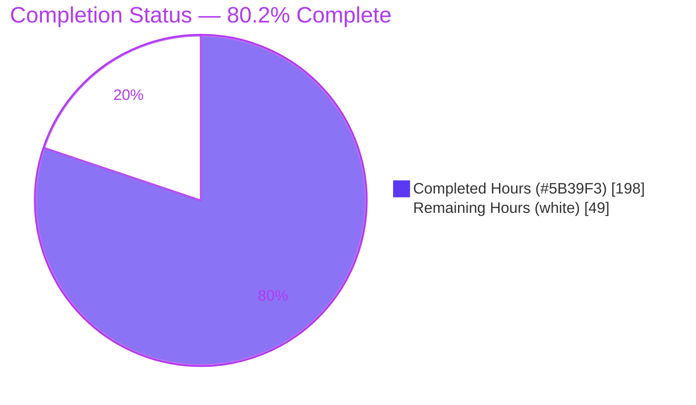
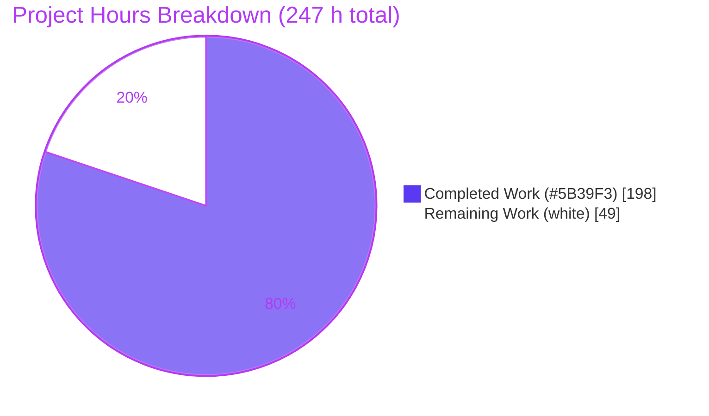
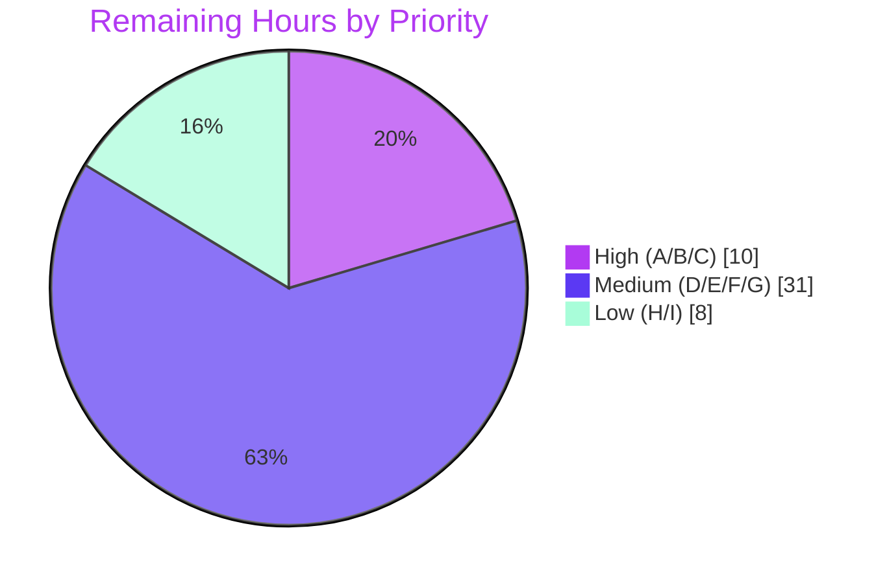

# Blitzy Project Guide — kitchensink Spring Boot Microservices Migration

<div align="center">

**Jakarta EE Monolith → Three Spring Boot 3.x Microservices**

`marketplace-service` · `orders-service` · `users-service`

Branch `blitzy-c17eeb3e-128e-4ced-bed6-4f7fa69b3fba` · HEAD `a2a74028e`

</div>

> **Brand color legend** — <span style="color:#5B39F3">■</span> **Completed / AI Work = Dark Blue `#5B39F3`** · <span style="color:#B23AF2">■</span> Headings/Accents = Violet-Black `#B23AF2` · <span style="color:#A8FDD9">■</span> Highlight = Mint `#A8FDD9` · □ **Remaining / Not Completed = White `#FFFFFF`**

---

## 1. Executive Summary

### 1.1 Project Overview

This project refactors the `kitchensink` Jakarta EE 10 / JBoss EAP 8.0 WAR monolith into three independently deployable Spring Boot 3.x (Java 17) microservices — **marketplace** (product catalog, pricing, vendor selection), **orders** (cart, order orchestration, discounting, shipping), and **users** (member registration, loyalty tiers) — decomposed strictly along business-domain lines and communicating only over HTTP. Business logic formerly concentrated in six PL/pgSQL stored procedures is re-implemented in Java with zero native queries, preserving 100% of observable behavior. Target consumers are the existing PHP storefront and internal service-to-service callers. The refactor is a dual tech-stack + domain-decomposition migration delivering executable fat JARs, containers, and CI.

### 1.2 Completion Status

The project is **80.2% complete** on an AAP-scoped basis. All Agent Action Plan development scope is delivered and validated; the remaining hours are path-to-production activities requiring human infrastructure and organizational access.



| Metric | Value |
|---|---|
| **Total Hours** | **247 h** |
| Completed Hours (AI: 198 + Manual: 0) | **198 h** |
| Remaining Hours | **49 h** |
| **Percent Complete** | **80.2%** (198 ÷ 247 × 100) |

> Calculation: `Completion % = Completed ÷ (Completed + Remaining) × 100 = 198 ÷ 247 × 100 = 80.2%`. Completed hours are 100% autonomously delivered by Blitzy agents (0 manual hours to date).

### 1.3 Key Accomplishments

- ✅ **Monolith fully decomposed** into three bounded-context Spring Boot services; legacy `kitchensink/src` removed; parent POM is a pure aggregator (`packaging=pom`, 3 modules, **no** inter-service compile dependencies).
- ✅ **T1 — Zero native queries:** all six stored procedures re-implemented in Java; `createNativeQuery` / `nativeQuery=true` / `@Query` counts all **0**; 100% Spring Data derived-name queries.
- ✅ **T2 — Stack migration:** EJB/CDI/JAX-RS → Spring (`11 @Service`, `4 @RestController`, `9 @Component`, `@Scheduled`, `@Transactional`, `11 JpaRepository`); no `EntityManager` / EJB / CDI residue.
- ✅ **T3 — HTTP-only bounded contexts:** zero cross-service package imports; three thin `@Component` HTTP clients enforce Contracts C1–C3; `RestTemplate` never used directly in `@Service` classes.
- ✅ **G1–G6 delivered:** six extractions with exact business-rule constants; `orchestrateOrder()` dual-path consolidation (G2); three clients (G3); runnable JARs + `/actuator/health` (G4); Dockerfiles + CI + README (G5); six Arquillian ITs migrated to `@SpringBootTest` + Testcontainers (G6).
- ✅ **42/42 integration tests pass** — independently reproduced in-session via `mvn -B clean verify` on genuine Testcontainers `postgres:16-alpine` (0 failures/errors/skipped); three executable fat JARs produced.
- ✅ **Runtime + cross-service flow validated:** all three services boot `{"status":"UP"}`; live price → tier → discount → shipping → submit → spend-write flow exercised across all three directions.
- ✅ **Security/resilience hardening** beyond AAP scope: internal-token auth, registration rate-limiting, concurrent double-submit → 409, RestTemplate timeouts → 503 translation.

### 1.4 Critical Unresolved Issues

There are **no unresolved code defects** — the implementation compiles cleanly and passes 42/42 tests. The items below are path-to-production readiness gaps, not code blockers.

| Issue | Impact | Owner | ETA |
|---|---|---|---|
| Production PostgreSQL not provisioned; `ddl-auto=validate` proven only against dev schema | Services cannot boot in prod until a managed DB with `db/01_schema.sql` exists | Platform / DevOps | 0.5 day |
| Secrets (`DB_USERNAME`, `DB_PASSWORD`, `SECURITY_INTERNAL_TOKEN`) supplied via plain env in dev | Insecure for prod; token has no default by design (fails fast) | Security / DevOps | 0.5 day |
| CI workflow never executed on real GitHub Actions | First run must confirm Docker-in-Docker Testcontainers on the runner | DevOps | 0.5 day |
| GAP-3 post-commit member-spend write is non-transactional | Order can commit while spend increment fails (eventually consistent) | Backend | 1 day |

### 1.5 Access Issues

| System / Resource | Type of Access | Issue Description | Resolution Status | Owner |
|---|---|---|---|---|
| Production PostgreSQL | Database credentials + network | Not provisioned in this environment; dev/test used Testcontainers + a local seeded DB | Open — human provisioning required | Platform / DevOps |
| Secrets manager (Vault / GH / K8s Secrets) | Write access | `DB_*` and `SECURITY_INTERNAL_TOKEN` must be stored securely per environment | Open | Security / DevOps |
| GitHub Actions | Repo CI execution | Workflow file present but never run on GitHub infrastructure | Open | DevOps |
| Container registry | Push access | Images build locally; no registry publish configured | Open | DevOps |

> Note: No access issue blocked autonomous development, compilation, or testing — all were completed offline using cached dependencies, Docker, and Testcontainers.

### 1.6 Recommended Next Steps

1. **[High]** Provision managed PostgreSQL, load `db/01_schema.sql` + `db/03_seed_data.sql`, and confirm all three services boot with `ddl-auto=validate`.
2. **[High]** Store `DB_USERNAME`, `DB_PASSWORD`, and the shared `SECURITY_INTERNAL_TOKEN` in a secrets manager; set per-service `services.*.base-url` per environment.
3. **[High]** Run the CI pipeline on GitHub Actions and confirm `mvn -B clean verify` (42/42) on a Docker-enabled runner.
4. **[Medium]** Publish the three images to a registry, author K8s/Compose manifests, deploy to staging, and smoke-test the cross-service order flow.
5. **[Medium]** Harden GAP-3 (idempotent spend increment + reconciliation) and wire observability (metrics, dashboards, alerting, log aggregation).

---

## 2. Project Hours Breakdown

### 2.1 Completed Work Detail

All completed work was autonomously delivered by Blitzy agents and independently validated. Each component traces to a specific AAP requirement.

| Component | Hours | Description |
|---|---:|---|
| Build & module restructuring | 10 | WAR → aggregator parent POM + 3 Spring Boot child POMs; full dependency swap (JBoss/Arquillian → Spring Boot 3.5.16 BOM, single hand-pin) |
| Entity relocation (10 entities) | 6 | `Member`, `Product`, `Vendor`, `VendorInventory(+Id)`, `Order`, `OrderItem`, `OrderDraftItem`, `ShippingZone`, `DiscountAudit` moved by domain; `jakarta.*` mappings preserved |
| Spring Data repositories (11) | 10 | `EntityManager`/Criteria → `JpaRepository` derived queries; zero native/`@Query` |
| G1 · `calculate_price` → PricingService | 6 | Volume tiers .15/.10/.05/.02; `base×(1+markup/100)×(1−vol)` round-4; missing inventory → 404 |
| G1 · `select_best_vendor` → VendorSelectionService | 7 | **Highest-score** formula (Source A) `1/normPrice×.60 + rating/5×.30 + 1/shipDays×.10`; SQL lowest-score explicitly overridden |
| G1 · `apply_customer_discount` → DiscountService | 7 | Tier rates PLATINUM .12/GOLD .08/SILVER .05/BRONZE .02; `DiscountAudit` persisted each call; tier via `UsersClient` |
| G1 · `calculate_shipping` → ShippingService | 6 | Zone prefix lookup; `MAX(5.99, rate×weight)`; expedite ×2.5; default 1.50 |
| G1+G2 · `process_order` → OrderService.`orchestrateOrder` | 14 | Single shared private orchestration for preview + submit; HTTP outside `@Transactional`; subtotal/discount/shipping/total |
| G1 · `recalculate_customer_tiers` → TierRecalculationService | 6 | Thresholds 5000/2000/500; `@Scheduled(cron="0 0 2 * * *")` + `@EnableScheduling`; per-member spend via `OrdersClient` |
| G3 · Cross-service HTTP clients + DTOs + config | 16 | `MarketplaceClient`, `UsersClient`, `OrdersClient`; local `*Dto`s; `RestTemplateConfig` with timeouts; status→exception translation |
| REST controllers (4) | 18 | JAX-RS → `@RestController`; paths preserved (`/api/products`, `/api/orders`, `/api/members`); Contracts C1–C3; `qty` param; 200/400/404/409 semantics; `InternalOrderResourceRESTService` |
| G4 · Spring Boot bootstrap | 6 | Three `@SpringBootApplication` classes; three `application.properties`; actuator `health,info,metrics` |
| GAP-1/2/3 resolutions | 10 | `/quote` endpoint (vendorId+unitPrice+weightLbs); weight propagation; internal spend endpoint + post-commit member-spend write |
| G6 · Test migration (10 ITs / 42 methods) | 30 | Six Arquillian ITs → `@SpringBootTest` + Testcontainers PostgreSQL + JUnit 5 + `MockRestServiceServer`, plus 4 hardening ITs; test schema/seed |
| G5 · Operational deliverables | 12 | 3 multi-stage Dockerfiles; root `ci.yml`; `README.adoc`; `frontend/config.php` repoint |
| Security / resilience / concurrency hardening | 18 | Internal-token auth + interceptors; registration rate-limiter; concurrent-submit → 409; timeouts → 503; security-headers filter |
| Autonomous validation + checkpoint & QA remediation | 16 | CP1–CP3 review fixes; QA F4/F5/F8/F9; final acceptance; ORD-CONC-1 |
| **Total Completed** | **198** | |

### 2.2 Remaining Work Detail

All remaining work is path-to-production and requires human infrastructure, credentials, or organizational sign-off.

| Category | Hours | Priority |
|---|---:|---|
| A. Production PostgreSQL provisioning + `ddl-auto=validate` against prod schema | 4 | High |
| B. Secrets & configuration management (`DB_*`, `SECURITY_INTERNAL_TOKEN`, base-URLs) | 3 | High |
| C. CI/CD first-run on GitHub Actions (Docker-enabled runner for Testcontainers) | 3 | High |
| D. Container registry publish + deploy manifests (K8s/Compose) + staging/prod deploy + smoke test | 12 | Medium |
| E. GAP-3 distributed-transaction hardening (idempotent increment + reconciliation) | 5 | Medium |
| F. Observability (metrics scrape, dashboards, alerting, log aggregation) | 8 | Medium |
| G. Security review & scanning (dependency CVE, internal-token/mTLS, TLS termination) | 6 | Medium |
| H. Performance & load testing (throughput/latency, HikariCP tuning, retry/circuit-breaker) | 5 | Low |
| I. Peer review, PR merge & release sign-off | 3 | Low |
| **Total Remaining** | **49** | |

### 2.3 Hours Reconciliation

| Check | Result |
|---|---|
| Section 2.1 Completed total | 198 h |
| Section 2.2 Remaining total | 49 h |
| **2.1 + 2.2 = Total (Section 1.2)** | **198 + 49 = 247 h ✅** |
| Remaining matches Section 1.2 & Section 7 | 49 h ✅ |
| Human task list total (Section 8) | 49 h ✅ |

---

## 3. Test Results

All tests originate from Blitzy's autonomous validation logs and were **independently reproduced in this session** with the exact acceptance command `mvn -B clean verify` on Testcontainers `postgres:16-alpine`: **BUILD SUCCESS, 42/42 pass, 0 failures / 0 errors / 0 skipped.** Frameworks: `@SpringBootTest` + Testcontainers PostgreSQL + JUnit 5; downstream peers stubbed with `MockRestServiceServer` (no live peers required).

| Test Suite (Category) | Framework | Total | Passed | Failed | Pass % | Notes |
|---|---|---:|---:|---:|---:|---|
| `PricingServiceIT` — marketplace (Integration) | SpringBootTest + Testcontainers | 4 | 4 | 0 | 100% | Self-contained; asserts price parity vs seed |
| `DiscountServiceIT` — orders (Integration) | + MockRestServiceServer (C2 tier) | 3 | 3 | 0 | 100% | Tier stub; `DiscountAudit` persisted |
| `OrderServiceIT` — orders (Integration/E2E) | + MockRestServiceServer (C1 price/quote + C2 tier) | 9 | 9 | 0 | 100% | Full `orchestrateOrder`; `total_spend` increases on submit |
| `InternalOrderResourceIT` — orders (API) | SpringBootTest MockMvc | 5 | 5 | 0 | 100% | C3 spend endpoint; 401 without internal token |
| `OrderSubmitConcurrencyIT` — orders (Concurrency) | SpringBootTest + Testcontainers | 2 | 2 | 0 | 100% | Concurrent double-submit → 409 (ORD-CONC-1) |
| `MemberRegistrationIT` — users (Integration) | SpringBootTest + Testcontainers | 3 | 3 | 0 | 100% | Register 200, duplicate 409, invalid 400 |
| `RemoteMemberRegistrationIT` — users (E2E black-box) | SpringBootTest RANDOM_PORT | 3 | 3 | 0 | 100% | `POST /users/api/members` over HTTP, expect 200 |
| `TierRecalculationIT` — users (Integration) | + MockRestServiceServer (C3 spend) | 6 | 6 | 0 | 100% | Nightly recalc; benign WARN = intentional 5xx negative-path stub |
| `MemberSpendIT` — users (API/Integration) | SpringBootTest + Testcontainers | 6 | 6 | 0 | 100% | Spend aggregation semantics |
| `RegistrationRateLimitIT` — users (Security) | SpringBootTest | 1 | 1 | 0 | 100% | Rate-limiter enforcement (ADV-1) |
| **Totals** | | **42** | **42** | **0** | **100%** | marketplace 4 · orders 19 · users 19 |

**Coverage note:** the autonomous suite reports a functional/behavioral pass rate (100%, 42/42) rather than line coverage; JaCoCo line-coverage was not part of the acceptance run. Behavioral coverage spans all six AAP-mandated integration tests (G6) plus four hardening suites. The six AAP-required parity tests (`PricingServiceIT`, `DiscountServiceIT`, `OrderServiceIT`, `MemberRegistrationIT`, `RemoteMemberRegistrationIT`, `TierRecalculationIT`) all pass.

---

## 4. Runtime Validation & UI Verification

Runtime validation (from autonomous logs, corroborated by in-session build + JAR production):

- ✅ **marketplace-service (:8081 `/marketplace`)** — Operational. `GET /api/products/{id}/price?vendorId=&qty=` → bare `BigDecimal` (e.g. `8.9858`); `/quote` → `{vendorId, unitPrice, weightLbs}`; missing inventory → 404.
- ✅ **orders-service (:8082 `/orders`)** — Operational. Cart add → 201; preview (orders→marketplace price/quote + orders→users tier) → subtotal 1045.53, discount 83.64 (GOLD 8% confirms C2), shipping 8.44, total 970.33; submit → `{orderId}` 201.
- ✅ **users-service (:8083 `/users`)** — Operational. `GET /api/members/{id}/tier` → `{"tier":"GOLD"}`; register → 200 (preserved), duplicate → 409, invalid → 400, missing → 404.
- ✅ **Contract 3 (spend)** — Operational. `GET /orders/internal/members/{id}/spend?days=` → `{"totalSpend":970.33}` **with** `X-Internal-Service-Token` (200); **without** → 401.
- ✅ **GAP-3 post-commit write** — Operational. `member1.total_spend` 3250.00 → 4220.33 after submit; order/order_items/discount_audit rows persisted.
- ✅ **Health** — All three `/actuator/health` = `{"status":"UP"}`; service logs error-free; clean shutdown.
- ✅ **All three cross-service directions exercised** (orders→marketplace, orders→users, users→orders).

**UI Verification:** No UI redesign in scope. The legacy JSF member screen was dropped with the WAR; the PHP storefront (`kitchensink/frontend/`) is functionally unchanged with `config.php` repointed to the three per-service base URLs. Member registration remains available via the `users-service` REST endpoint.

Legend: ✅ Operational · ⚠ Partial · ❌ Failing — **no ⚠ or ❌ items at runtime.**

---

## 5. Compliance & Quality Review

| AAP Requirement / Benchmark | Status | Evidence / Notes |
|---|---|---|
| T1 — Zero native queries | ✅ Pass | 0 `createNativeQuery`, 0 `nativeQuery=true`, 0 `@Query` (main + test) |
| T2 — Jakarta EE → Spring component model | ✅ Pass | 11 `@Service`, 4 `@RestController`, 9 `@Component`, `@Scheduled`, `@Transactional`, 11 `JpaRepository`; no EJB/CDI/`EntityManager` |
| T3 — HTTP-only bounded contexts | ✅ Pass | 0 cross-service package imports; parent POM has no inter-service compile deps |
| G1 — Six stored-procedure extractions | ✅ Pass | Exact constants verified for all six services |
| G2 — Dual-path consolidation | ✅ Pass | Single private `orchestrateOrder()` shared by preview + submit |
| G3 — Cross-service HTTP clients | ✅ Pass | `MarketplaceClient`, `UsersClient`, `OrdersClient` as thin `@Component`s |
| G4 — Standalone runnable services | ✅ Pass | 3 executable fat JARs; `/actuator/health` = UP |
| G5 — Operational deliverables | ✅ Pass | 3 multi-stage Dockerfiles; root `ci.yml`; `README.adoc`; `config.php` |
| G6 — Test carry-forward | ✅ Pass | 6 Arquillian ITs → `@SpringBootTest` + Testcontainers (+4 hardening) |
| Contract Authority C1/C2/C3 | ✅ Pass | Runtime-validated shapes, status codes, exception mappings |
| Source-A precedence (best-vendor highest-score) | ✅ Pass | Highest-score formula implemented; SQL ordering explicitly not copied |
| Preserve REST paths | ✅ Pass | `/api/products`, `/api/orders`, `/api/members` under context-paths |
| Preserve business-rule constants | ✅ Pass | Volume/discount/tier/shipping constants match AAP exactly |
| Preserve member-create 200 | ✅ Pass | `RemoteMemberRegistrationIT` asserts 200 |
| `DiscountAudit` per calculation | ✅ Pass | Persisted on every discount call |
| Single `@Transactional` submit boundary | ✅ Pass | HTTP outside transaction; persist inside |
| Scope discipline (siblings/root POM/db untouched) | ✅ Pass | Only `kitchensink/` + root `ci.yml` changed |
| Bean Validation carry-over | ✅ Pass | `Member` `jakarta.validation` constraints under validation starter |

**Fixes applied during autonomous validation:** CP1–CP3 review findings (POM packaging, frontend routing, UsersClient 404 mapping, 16 CP3 findings); QA F4 (resilience timeouts/503), F5 (rate-limiter XFF bypass, legacy JSF removal), F8 (README accuracy), F9 (PHP continuity, `qty` alias); final QA acceptance (1 Major + 4 Minor); ORD-CONC-1 (concurrent submit → 409).

**Outstanding compliance items:** none within AAP scope. Path-to-production hardening (TLS, secret rotation, CVE scanning) is tracked in Sections 2.2 and 6.

---

## 6. Risk Assessment

| Risk | Category | Severity | Probability | Mitigation | Status |
|---|---|---|---|---|---|
| GAP-3 post-commit member-spend write can fail after order commit | Technical | Medium | Medium | Idempotent increment + nightly tier-recalc reconciliation from CONFIRMED orders | Partially Mitigated |
| `ddl-auto=validate` vs shared DB — prod schema drift aborts boot | Technical | Medium | Low | Adopt Flyway/Liquibase or CI schema check | Open (dev-validated) |
| Numeric parity depends on BigDecimal/double rounding vs PL/pgSQL | Technical | Low | Low | 42 ITs assert parity vs seed | Mitigated |
| All derived queries; Java-side shipping-zone prefix scan | Technical | Low | Low | Index review + perf test | Open |
| Internal-endpoint auth = shared static bearer token (no rotation/mTLS) | Security | Medium | Medium | Rotate secret, network policy, consider mTLS | Basic control in place |
| DB creds + token via env vars — leakage if not from secrets manager | Security | Medium | Medium | Vault / GH / K8s Secrets | Open |
| No in-app TLS (plaintext inter-service HTTP) | Security | Medium | Medium | TLS at ingress / service mesh | Open |
| Dependency CVE posture unscanned (offline); SB 3.5.16 current | Security | Low-Medium | Low | OWASP dependency-check / Snyk in CI | Open |
| CI never run on real GitHub Actions (Testcontainers needs DinD) | Operational | Medium | Medium | Run pipeline once; `mvn -B clean verify` proven locally | Command-proven; GH run pending |
| No prod observability wiring (health/info/metrics exposed only) | Operational | Medium | Medium | Prometheus/Grafana + log shipping | Open |
| Images built locally, not published; no deploy manifests | Operational | Medium | Medium | Registry publish + manifests + staging deploy | Open |
| Nightly `@Scheduled` recalc runs per replica if scaled | Operational | Low-Medium | Medium | Leader election / ShedLock or single-replica scheduler | Open |
| No retry/circuit-breaker for peer calls (only timeouts→503) | Integration | Medium | Medium | Add Resilience4j retry/CB; chaos test | Timeouts+503 in place |
| Per-service base-URLs via properties — env misconfig breaks flow | Integration | Low | Medium | Startup config validation | Open |
| Shared PostgreSQL — combined connection-pool sizing untested | Integration | Low-Medium | Low | Tune HikariCP + load test | Open |

**Summary:** 15 risks (4 technical, 4 security, 4 operational, 3 integration). None indicates incomplete AAP development scope; all are path-to-production or hardening concerns that map to the remaining-work categories in Section 2.2.

---

## 7. Visual Project Status

### Project Hours Breakdown (Completed vs Remaining)



### Remaining Work by Priority (49 h)



### Remaining Hours per Category (Section 2.2)

| Category | Hours | Bar |
|---|---:|---|
| D. Registry + deploy + staging | 12 | ████████████ |
| F. Observability | 8 | ████████ |
| G. Security review | 6 | ██████ |
| E. GAP-3 hardening | 5 | █████ |
| H. Performance & load | 5 | █████ |
| A. Prod DB provisioning | 4 | ████ |
| B. Secrets & config | 3 | ███ |
| C. CI first-run | 3 | ███ |
| I. Peer review & sign-off | 3 | ███ |
| **Total** | **49** | |

> **Integrity check:** pie "Remaining Work" (49) = Section 1.2 Remaining (49) = Section 2.2 total (49). ✅

---

## 8. Summary & Recommendations

**Achievements.** The `kitchensink` monolith has been fully and faithfully migrated to three Spring Boot 3.x microservices. Every AAP goal (G1–G6), transformation (T1–T3), contract (C1–C3), and cross-domain gap (GAP-1/2/3) is delivered, with all business-rule constants preserved exactly and the Source-A highest-score vendor rule correctly applied. The work is validated to a high bar: **42/42 integration tests pass** on real Testcontainers PostgreSQL — independently reproduced in this session — the full reactor builds to three executable fat JARs, and the live three-way cross-service flow was exercised end-to-end.

**Remaining gaps.** The outstanding **49 hours (19.8%)** are exclusively path-to-production activities that require human access an autonomous agent cannot obtain: provisioning managed infrastructure, storing secrets, running CI on GitHub, publishing images and deploying, hardening the GAP-3 distributed transaction, wiring observability, completing a security review, load testing, and peer sign-off.

**Critical path to production.** (1) Provision DB + secrets → (2) run CI on GitHub → (3) publish images + deploy to staging → (4) harden GAP-3 + observability + security review → (5) load test → (6) peer review, merge, sign-off.

**Success metrics.** Behavioral parity confirmed by 42/42 tests; zero native queries; zero cross-service imports; all health checks UP; contracts C1–C3 validated at runtime.

**Production readiness assessment.** The codebase is **code-complete and validation-green (80.2% overall)**. It is **ready for staging deployment** once High-priority infrastructure and secrets tasks are complete, and **ready for production** after the Medium-priority deploy/hardening/security items and final sign-off. No code rework is anticipated.

| Metric | Value |
|---|---|
| AAP-scoped completion | 80.2% (198 / 247 h) |
| AAP development scope delivered | 100% (all G1–G6, T1–T3, C1–C3, GAP-1/2/3) |
| Tests passing | 42 / 42 (100%) |
| Remaining (path-to-production) | 49 h |
| Anticipated code rework | 0 h |

---

## 9. Development Guide

### 9.1 System Prerequisites

| Tool | Version (verified) | Purpose |
|---|---|---|
| JDK | Java 17 (17.0.19) | Compile & run (Spring Boot 3.x baseline) |
| Maven | 3.9.9 | Build / test / package |
| Docker | 28.5.2 | Testcontainers (tests) + image builds |
| PostgreSQL | 16 (runtime) / `psql` 17 client | Application database; tests use `postgres:16-alpine` |
| Network | Maven Central (first build only) | Dependency resolution |

### 9.2 Environment Setup

```bash
# From the repository root
cd kitchensink

# Required environment variables (all three services read these)
export DB_USERNAME=kitchensink
export DB_PASSWORD=kitchensink
# Shared secret for internal service-to-service auth (REQUIRED, no default — fails fast if unset)
export SECURITY_INTERNAL_TOKEN='choose-a-strong-shared-secret'
```

Per-service configuration lives in each `src/main/resources/application.properties`:

| Service | Port | Context-path | Downstream base-URLs |
|---|---|---|---|
| marketplace-service | 8081 | `/marketplace` | — |
| orders-service | 8082 | `/orders` | `services.marketplace.base-url`, `services.users.base-url` |
| users-service | 8083 | `/users` | `services.orders.base-url` |

### 9.3 Database Initialization

```bash
# Create and seed the application database (skip if using a managed instance)
createdb kitchensink
psql -d kitchensink -f db/01_schema.sql      # authoritative schema (9 tables)
psql -d kitchensink -f db/03_seed_data.sql   # seed data
# DO NOT load db/02_stored_procedures.sql — retained as reference only;
# the migrated services never call these functions (T1).
```

### 9.4 Dependency Installation & Build

```bash
cd kitchensink

# Resolve dependencies (first run needs Maven Central)
mvn -B dependency:go-offline

# Build, test, and package all three services + aggregator.
# This is the EXACT CI / acceptance command. Requires a running Docker
# daemon (Testcontainers spins postgres:16-alpine on random ports).
mvn -B clean verify
# Expected: BUILD SUCCESS — Tests run: 42, Failures: 0, Errors: 0, Skipped: 0
#           (marketplace 4, orders 19, users 19)
```

### 9.5 Application Startup

```bash
# Ensure PostgreSQL is running and the env vars from 9.2 are exported.
# Start each service (separate shells, or append & to background each):
java -jar marketplace-service/target/marketplace-service-8.0.0.GA.jar
java -jar orders-service/target/orders-service-8.0.0.GA.jar
java -jar users-service/target/users-service-8.0.0.GA.jar
```

### 9.6 Verification

```bash
curl http://localhost:8081/marketplace/actuator/health   # {"status":"UP"}
curl http://localhost:8082/orders/actuator/health         # {"status":"UP"}
curl http://localhost:8083/users/actuator/health          # {"status":"UP"}
```

### 9.7 Example Usage

```bash
# Contract 1 — Pricing (bare BigDecimal, e.g. 8.9858)
curl "http://localhost:8081/marketplace/api/products/1/price?vendorId=1&qty=10"

# Contract 2 — Tier
curl "http://localhost:8083/users/api/members/1/tier"          # {"tier":"GOLD"}

# Contract 3 — Spend (internal; requires the shared token)
curl -H "X-Internal-Service-Token: $SECURITY_INTERNAL_TOKEN" \
     "http://localhost:8082/orders/internal/members/1/spend?days=90"   # {"totalSpend":...}

# Register a member (200 OK on success; 409 duplicate; 400 invalid)
curl -X POST "http://localhost:8083/users/api/members" \
     -H "Content-Type: application/json" \
     -d '{"name":"Jane Doe","email":"jane@example.com","phoneNumber":"1234567890"}'
```

### 9.8 Container Build & Run (optional)

```bash
# Each service builds standalone (child POM uses empty <relativePath/>).
cd marketplace-service && docker build -t marketplace-service:local . && cd ..
docker run --rm -p 8081:8081 \
  -e DB_USERNAME -e DB_PASSWORD \
  -e SPRING_DATASOURCE_URL='jdbc:postgresql://host.docker.internal:5432/kitchensink' \
  marketplace-service:local
# Repeat for orders-service (8082) and users-service (8083).
```

### 9.9 Troubleshooting

| Symptom | Likely Cause | Resolution |
|---|---|---|
| Service fails to boot with schema-validation error | `ddl-auto=validate` and schema not loaded / drift | Load `db/01_schema.sql`; ensure DB matches owned entities |
| `401 Unauthorized` on `/internal/...` | Missing/incorrect `X-Internal-Service-Token` | Set `SECURITY_INTERNAL_TOKEN` identically on caller & callee |
| `mvn verify` fails at test stage | Docker daemon down or `postgres:16-alpine` unavailable | Start Docker; ensure image pullable for Testcontainers |
| Cross-service call returns `503` | Peer service down or `services.*.base-url` misconfigured | Start peers; verify base-URL properties per environment |
| Port already in use | 8081/8082/8083 occupied | Stop conflicting process or override `server.port` |
| First build fails downloading dependencies | No network to Maven Central | Provide network access for the first `mvn` run |

---

## 10. Appendices

### A. Command Reference

| Purpose | Command |
|---|---|
| Resolve dependencies offline | `mvn -B dependency:go-offline` |
| Build + test + package (CI/acceptance) | `mvn -B clean verify` |
| Compile only (no tests) | `mvn -B clean test-compile` |
| Run a service | `java -jar <service>/target/<service>-8.0.0.GA.jar` |
| Health check | `curl http://localhost:<port>/<context>/actuator/health` |
| Load schema / seed | `psql -d kitchensink -f db/01_schema.sql` · `-f db/03_seed_data.sql` |
| Build image | `docker build -t <service>:local .` (run inside the service dir) |

### B. Port Reference

| Service | Port | Context-path | Health endpoint |
|---|---|---|---|
| marketplace-service | 8081 | `/marketplace` | `/marketplace/actuator/health` |
| orders-service | 8082 | `/orders` | `/orders/actuator/health` |
| users-service | 8083 | `/users` | `/users/actuator/health` |

### C. Key File Locations

| Path | Description |
|---|---|
| `kitchensink/pom.xml` | Parent aggregator (`packaging=pom`, 3 modules) |
| `kitchensink/{marketplace,orders,users}-service/` | The three Spring Boot modules |
| `kitchensink/*/src/main/resources/application.properties` | Per-service configuration |
| `kitchensink/*/Dockerfile` | Multi-stage image builds |
| `kitchensink/db/01_schema.sql` · `03_seed_data.sql` | Schema & seed (loaded) |
| `kitchensink/db/02_stored_procedures.sql` | Reference only — never called |
| `.github/workflows/ci.yml` | CI (JDK 17, `mvn -B clean verify`) |
| `kitchensink/frontend/includes/config.php` | Storefront base-URL constants |

### D. Technology Versions

| Component | Version |
|---|---|
| Java | 17 |
| Spring Boot | 3.5.16 (single hand-pin; all else BOM-managed) |
| Maven | 3.9.9 |
| PostgreSQL | 16 (tests: `postgres:16-alpine`) |
| Testcontainers | via Spring Boot dependencies BOM |
| Build/runtime image base | `maven:3.9-eclipse-temurin-17` → `eclipse-temurin:17-jre-alpine` |

### E. Environment Variable Reference

| Variable | Required | Used By | Notes |
|---|---|---|---|
| `DB_USERNAME` | Yes | all 3 | PostgreSQL user |
| `DB_PASSWORD` | Yes | all 3 | PostgreSQL password |
| `SECURITY_INTERNAL_TOKEN` | Yes | orders, users | Shared bearer for internal endpoints; **no default** (fails fast) |
| `services.marketplace.base-url` | Env-specific | orders | Default `http://localhost:8081/marketplace` |
| `services.users.base-url` | Env-specific | orders | Default `http://localhost:8083/users` |
| `services.orders.base-url` | Env-specific | users | Default `http://localhost:8082/orders` |

### F. Developer Tools Guide

- **Testcontainers** spins a disposable `postgres:16-alpine` per test run on a random port — no manual DB needed for `mvn verify`; requires a running Docker daemon.
- **MockRestServiceServer** stubs downstream peers (bound to the shared `RestTemplate` bean) so integration tests run without live peer services.
- **Spring Boot Actuator** exposes `health`, `info`, `metrics` at `/<context>/actuator/*`.
- **Multi-stage Docker**: build stage compiles + repackages the fat JAR; runtime stage ships a JRE-only Alpine image running as a non-root `spring` user; tests are skipped in-image (`-DskipTests`) and run in CI instead.

### G. Glossary

| Term | Meaning |
|---|---|
| AAP | Agent Action Plan — the authoritative requirements for this refactor |
| Bounded context | A service owning its domain; no cross-service in-process calls |
| Contract (C1–C3) | The three inter-service HTTP request/response specifications |
| GAP-1/2/3 | Cross-domain concerns (best-vendor, product weight, member-spend write) |
| Source A / Source B | Prompt implementation details (authoritative) vs stored-procedure SQL |
| `ddl-auto=validate` | Hibernate validates entities against the existing schema; never mutates it |
| Fat JAR | Self-contained executable Spring Boot JAR |
| Thin client | Dedicated `@Component` wrapping `RestTemplate` for one downstream service |

---

<div align="center">

**Overall Completion: <span style="color:#5B39F3">80.2%</span> (198 / 247 h) · Tests 42/42 · AAP development scope 100% delivered**

*Remaining 49 h is path-to-production work requiring human infrastructure and organizational access.*

</div>